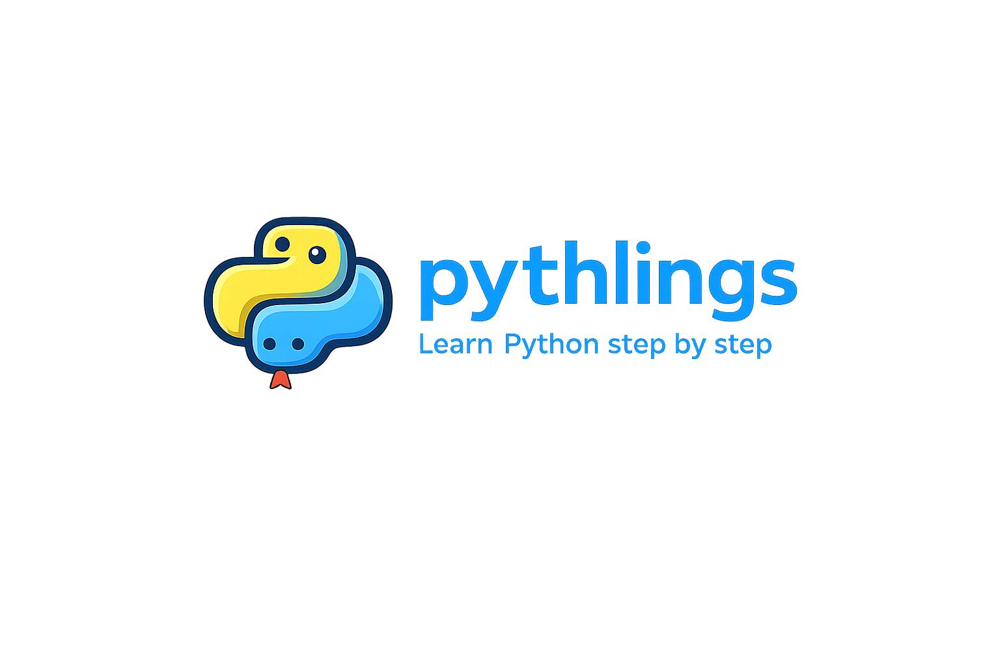

<a href=".">
  
</a>

`pythlings` is a Rustlings-style Python course that starts with absolute basics and gradually works up to more advanced, architecture-heavy exercises.

Run the CLI, fix the first broken file it points you to, check your work, and keep going. The whole point is to keep the next step obvious so you can focus on learning Python instead of deciding what to do next.

## Quick Start

We recommend `uv`, but use whatever is normal for your setup.

```powershell
git clone <your-repo-url>
cd pythlings
uv sync
uv run pythlings
```

If you would rather use plain `pip`:

```powershell
python -m venv .venv
.\.venv\Scripts\python.exe -m pip install -e .
.\.venv\Scripts\python.exe main.py
```

## How It Works

- checks exercises in order
- stops at the first one that fails
- shows you exactly which file you are on
- lets you re-check, ask for a hint, list exercises, reset the current file, or quit
- only moves forward once the current exercise is fixed

Work in `exercises/` and try not to open `solutions/` unless you want spoilers.

Typical output includes `Stuck at: exercises/00_intro/intro1.py`.

## CLI Commands

- `r` checks the current exercise and advances when it passes
- `h` shows the hint embedded in the current exercise
- `l` lists every exercise
- `c` checks the full course
- `x` resets the current exercise from its starter copy
- `q` quits

## Validation

Early exercises compare output directly. Later exercises can use validators in `.pythlings/validators/` so the harder parts of the course can check behavior, not just one printed line.

## Project Layout

```text
exercises/
solutions/
.pythlings/starters/
.pythlings/validators/
```

- `exercises/` is the learner-facing course
- `solutions/` contains reference answers
- `.pythlings/starters/` stores the broken reset copies
- `.pythlings/validators/` stores advanced behavior-based checks

## License

This project is licensed under the [MIT License](./LICENSE).
